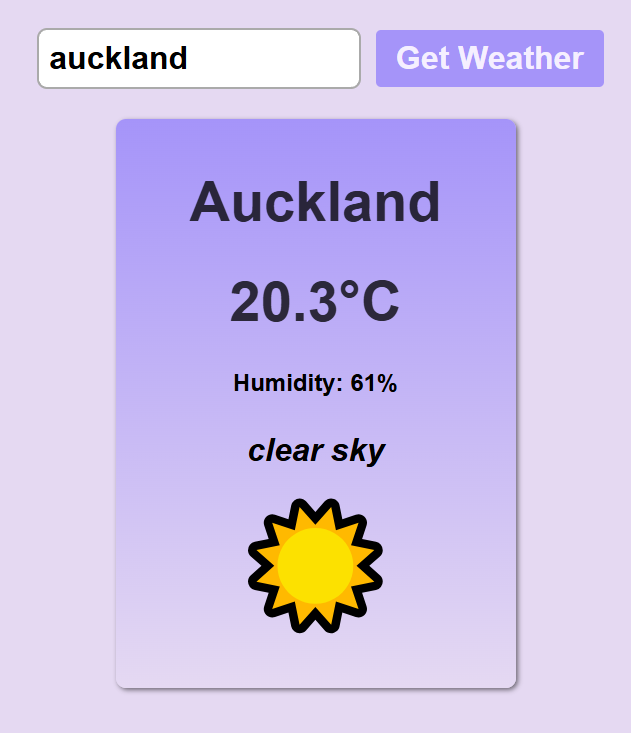

# Weather App

  
This weather application provides real-time and accurate weather information, with a user friendly graphical interface.'

  

<h2>Features</h2>
<ul>
  <li>Real-time weather information</li>
  <li>Support for cities worldwide</li>
 <li>Clear and simple layout</li> 
</ul>

<h2>Technologies Used</h2>
<ul>
  <li>JavaScript</li>
  <li>HTML</li>
 <li>CSSt</li> 
</ul>

<h2>Installation</h2>
To set up and run this Weather App locally, follow these steps:
<ol>
  <li>Clone the repository: git clone https://github.com/samrichell-smith/Weather-App.git</li>
  <li>Navigate to the directory: cd Weather-App</li>
  <li>Open the index.html file in your browser</li>
</ol>
